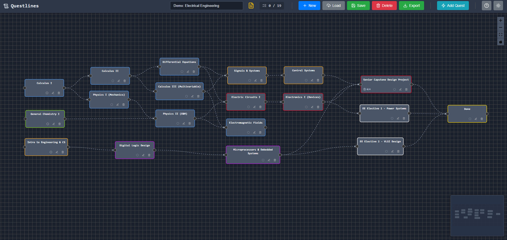

# questlines

An app to build questlines for organized and trackable self-learning goals.

This was made to look at self-learning like a Civilization "tech tree", where complex topics
have prerequisites on multiple simpler topics in different disciplines.

There's probably an application out there for easy "skill tree" or "questline" building like this,
but I couldn't find one and would rather learn some more by building it myself.

This is a prototype for a future task tracking application I have in mind and want
to work out the details on various features I'm planning.

## Demo

View demo (browser-only) version at - https://barrettotte.github.io/questlines/




## Development

```sh
# build (frontend, then backend)
make build

# run - served at http://localhost:8080
make run

# build docker image
make image

# run in container - served at http://localhost:8080
make run_docker

# run in browser-only mode (for demo purposes) - served at http://localhost:3000
make browser_only
```

### Limitations/Remarks

This is a prototype so I gave some features more attention than others and skipped other things.

- general
  - This app is single user with no login/security. This is designed for self-hosting on a network by yourself.
  - No unit tests implemented.
- backend
  - The backend only handles full `Questline` objects. Ideally I should have endpoints for quest, dependency, objective, etc.
  - The backend should be broken up into individual object stores and endpoint handlers.
  - Audit fields like `updated` and `created` were only added to the `questline` table.
  - I did not add a mechanism to rollback database migrations.
- frontend
  - The frontend relies on manual saving. Ideally I should be more chatty with the backend and save every change.
  - This was not designed with mobile in mind, so it probably looks terrible and doesn't function correctly.
  - Quest objective lists cannot be reorganized.
  - If separate endpoints on backend are implemented, there should be separate stores and services.

## References

- https://vueflow.dev/examples/
